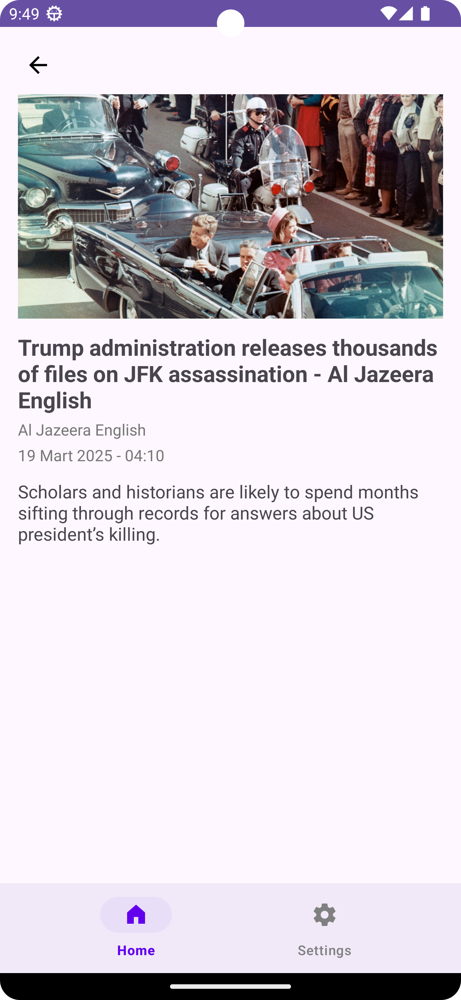
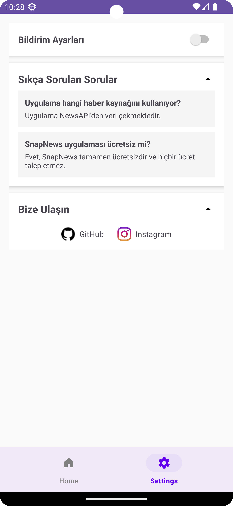

# 📱 SnapNews

SnapNews is a modern and lightweight news application that delivers real-time news articles via NewsAPI.  
The app offers an intuitive UI and smooth UX with breaking news headlines, search functionality, and Firebase integrations.

---

## ✨ Features

- 📰 **Breaking News Headlines** with auto-scroll slider (ViewPager2)
- 🔍 **Live Search** with debounce mechanism to optimize API calls
- 🗂️ **Dynamic News List** (removes headlines from the regular news feed)
- 📄 **Article Detail View** with article image, description, and publish date
- 📅 **Publish Date Formatter** to display readable dates
- ⚙️ **Settings Screen** with:
  - Notification toggle
  - Expandable FAQ section with multiple Q&A
  - Expandable "Contact Us" with clickable GitHub & Instagram links
- 📊 **Firebase Analytics** (tracks user actions like search, clicks)
- ⚠️ **Firebase Crashlytics** (automatically reports app crashes)
- 🧩 **MVVM Architecture**
- 🎨 **Material Design Components**

---

## 🛠️ Tech Stack

- **Language:** Kotlin
- **Architecture:** MVVM
- **API Client:** Retrofit2
- **Image Loading:** Glide
- **UI:** ViewPager2 + RecyclerView + SearchView + Material Components
- **Backend Services:** Firebase Analytics & Crashlytics
- **Navigation:** Jetpack Navigation Component

---

## 📷 Screenshots

### 🏠 Home Screen  
_Displaying breaking news headlines & news list_

### 📄 Detail Screen  
_News detail with image, title, and description_

### ⚙️ Settings Screen  
_FAQ section and Contact Us with social links_

---

## ⚙️ Installation

🚀 SnapNews Setup Guide

Follow these simple steps to quickly get SnapNews up and running on your machine.

📌 Step 1: Clone the Repository

Clone the repository to your local machine:

📌 Step 2: Open the Project

Open the cloned project folder in Android Studio:

Launch Android Studio.

Select "Open an Existing Project".

Navigate to the cloned SnapNews directory and select it.

📌 Step 3: Configure API Key

Insert your NewsAPI Key into the RetrofitClient.kt file:

You can obtain your API key from NewsAPI.org.

📌 Step 4: Run the App

Sync the Gradle project (File > Sync Project with Gradle Files).

Connect your emulator or physical Android device.

Click the Run ▶️ button in Android Studio to launch SnapNews.

🎉 That's it! You're all set to explore SnapNews!
## 📩 Contact

- **GitHub:** [@fatihparkin](https://github.com/fatihparkin)  
- **Instagram:** [@fatihparkin](https://instagram.com/fatihparkin)  

## 📄 License

This project is built for educational and portfolio purposes only.  
No commercial license is applied to this repository.
